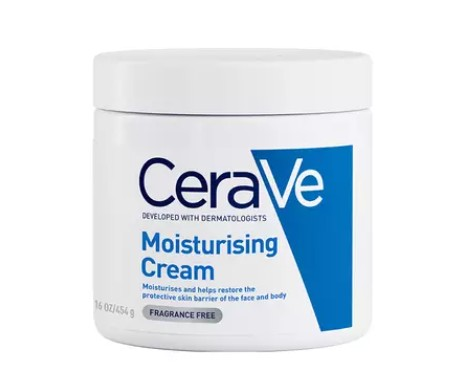
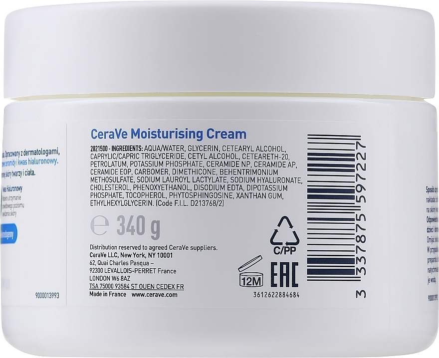

# Skincare Formula Intelligence Engine

A rule-based ingredient intelligence system that analyses skincare formulations for skin-type compatibility, risk profiling, and formulation quality — built without any ML model.

---

## Demo Video

A sample demo:

https://github.com/user-attachments/assets/ae06b746-8535-4975-891a-b607773fbcad


---

## Features

- **Ingredient Parsing** — Accepts INCI names, common aliases, and synonyms (e.g. Aqua → Water, BHA → Salicylic Acid, Cica → Centella Asiatica Extract)
- **Skin-Type Compatibility Scoring** — Scores each formula against all five skin types (Oily, Dry, Sensitive, Combination, Normal) simultaneously
- **Risk Profiling** — Skin-type-specific risk assessment per ingredient, not just a global risk flag
- **Ingredient Breakdown** — Per-ingredient cards showing compatibility score, risk badge, and top benefits for the selected skin type
- **Formula Strength Profile** — Confidence-tiered bar chart across six benefit dimensions (Hydration, Barrier Repair, Soothing, Brightening, Anti-Aging, Oil Control)
- **Suggested Ingredients** — Recommends missing beneficial ingredients per skin type with explanations
- **Ingredients to Reconsider** — Flags problematic ingredients with specific concern reasons
- **Formula Summary** — Human-readable verdict with score band, risk level, key benefits, and standout ingredients
- **Knowledge Base** — 200+ skincare actives, humectants, occlusives, exfoliants, preservatives, irritants, and botanicals

---

## Real Product Demo — CeraVe Moisturizing Cream

The analyzer was tested against the actual ingredient list of **CeraVe Moisturizing Cream** — one of the most dermatologist-recommended moisturizers for dry and sensitive skin globally.

### The Product



> *CeraVe Moisturizing Cream — Developed with dermatologists, accepted by the National Eczema Association.*

### Real Ingredient Label



### Ingredient List Used in Demo

Paste this directly into the analyzer to reproduce the demo result:

```
Aqua, Glycerin, Caprylic/Capric Triglyceride, Dimethicone,
Ceramide NP, Ceramide AP, Ceramide EOP, Carbomer,
Phenoxyethanol, Disodium EDTA, Xanthan Gum,
Phytosphingosine, Tocopherol, Sodium Hyaluronate,
Ethylhexylglycerin
```

**Select skin type:** `Dry`

### Result

| Metric | Value |
|---|---|
| Compatibility Score | 86 / 100 |
| Verdict | **Excellent Match for Dry Skin** |
| Risk Profile | Low |
| Primary Match | Dry Skin |
| Secondary Match | Sensitive Skin (85 / 100) |

> The analyzer independently scored CeraVe as an excellent match for dry and sensitive skin — which aligns exactly with how dermatologists and the National Eczema Association classify this product. This validates the ingredient-level scoring approach without any brand-specific training data.

---

## Tech Stack

| Layer | Technology |
|---|---|
| UI | Streamlit |
| Data | Pandas, CSV knowledge base |
| Visualisation | Plotly |
| Language | Python 3.10+ |
| Testing | pytest, pytest-cov |

---

## Project Structure

```
skincare-formula-intelligence-engine/
│
├── app.py                        # Streamlit application entry point
│
├── data/
│   └── ingredient_knowledge.csv  # Knowledge base (200+ ingredients)
│
├── utils/
│   ├── benefits.py               # Benefit and concern extraction
│   ├── knowledge_loader.py       # CSV loader and ingredient lookup
│   ├── parser.py                 # Ingredient parser and synonym resolver
│   ├── recommendations.py        # Addition and avoidance recommendations
│   ├── risk_analysis.py          # Skin-type-specific risk scoring
│   ├── scorer.py                 # Compatibility and formula scoring
│   └── summary_generator.py      # Human-readable formula summary
│
├── tests/
│   ├── conftest.py
│   ├── test_benefits.py
│   ├── test_coverage_gaps.py
│   ├── test_knowledge_loader.py
│   ├── test_parser.py
│   ├── test_recommendations.py
│   ├── test_risk_analysis.py
│   ├── test_scorer.py
│   └── test_summary_generator.py
│
├── reports/
│   ├── coverage_html/
│   ├── coverage_report.txt       # Coverage summary
│   └── test_report.txt           # Full verbose test output
│
├── assets/
│   ├── cerave_moisturizer.jpg    # Product photo used in demo
│   ├── cerave_ingredients.jpg    # Real ingredient label photo
│   └── Skincare_Formula_Intelligence_Engine_demo.mp4
│
├── components/                   # UI helper components
├── docs/                         # Additional documentation
├── generate_reports.py           # Script to regenerate test and coverage reports
├── requirements.txt
├── .gitignore
└── README.md
```

---

## Setup

### Prerequisites

- Python 3.10 or higher
- pip

### Installation

```bash
# 1. Clone the repository
git clone https://github.com/sindhuja8812/skincare-formula-intelligence-engine.git
cd skincare-formula-intelligence-engine

# 2. Create and activate a virtual environment (recommended)
python -m venv venv

# Windows
venv\Scripts\activate

# macOS / Linux
source venv/bin/activate

# 3. Install dependencies
pip install -r requirements.txt

# 4. Run the application
streamlit run app.py
```

---

## Usage

1. Enter or paste an ingredient list into the text area — comma, semicolon, or newline separated
2. Select your skin type from the dropdown
3. Click **Analyse Formula**
4. Review:
   - Compatibility score and verdict for your skin type
   - Cross-skin-type comparison table
   - Per-ingredient risk and score cards
   - Suggested ingredients and items to reconsider
   - Formula strength profile and summary

**Supported synonym formats:**

| Input | Resolves To |
|---|---|
| Aqua | Water |
| BHA | Salicylic Acid |
| Cica | Centella Asiatica Extract |
| Parfum | Fragrance |
| Vitamin C | L-Ascorbic Acid |
| Vitamin B5 | Panthenol |
| Zinc | Zinc PCA |
| EGCG | Epigallocatechin Gallate |

---

## Scoring Methodology

| Component | Method |
|---|---|
| Compatibility Score | Average skin-type score (0–10) across recognised active ingredients, scaled ×10, then ×0.90 realism factor. Maximum: 90/100 |
| Balanced Formula Score | Same method averaged across all five skin-type columns |
| Risk Level | High if ≥2 high-risk ingredients or 1 high + ≥2 moderate; Moderate if any single concern ingredient; Low otherwise |
| Coverage | Recognised ingredients ÷ total entered × 100% |

> Scores reflect ingredient-level data only. Concentration, pH, and manufacturing conditions are not accounted for.

---

## Testing

### Run tests

```bash
python -m pytest -v
```

### Run with coverage

```bash
python -m pytest --cov=utils --cov-report=term-missing
```

### Generate and save all reports

```bash
python generate_reports.py
```

### Test results

| Metric | Result |
|---|---|
| Total tests | 158 |
| Passed | 158 |
| Failed | 0 |
| Coverage (utils/) | 99% |
| Runtime | ~1s |

### Coverage by module

| Module | Coverage |
|---|---|
| `utils/benefits.py` | 100% |
| `utils/knowledge_loader.py` | 100% |
| `utils/parser.py` | 100% |
| `utils/risk_analysis.py` | 100% |
| `utils/summary_generator.py` | 100% |
| `utils/recommendations.py` | 98% |
| `utils/scorer.py` | 96% |

---

## Knowledge Base

The knowledge base (`data/ingredient_knowledge.csv`) covers 200+ ingredients across:

| Category | Examples |
|---|---|
| Humectants | Glycerin, Hyaluronic Acid, Sodium PCA, Betaine |
| Ceramides | Ceramide NP, Ceramide AP, Ceramide EOP |
| Actives | Niacinamide, Salicylic Acid, Retinol, Vitamin C |
| Botanicals | Centella Asiatica, Green Tea Extract, Aloe Vera |
| Emollients | Squalane, Jojoba Oil, Shea Butter |
| Antioxidants | Vitamin E, Ferulic Acid, Resveratrol, Coenzyme Q10 |
| Irritants | Fragrance, Alcohol Denat, Menthol, SLS |
| Preservatives | Phenoxyethanol, Sodium Benzoate |
| Exfoliants | Glycolic Acid, Lactic Acid, Salicylic Acid, PHAs |
| Sunscreens | Zinc Oxide, Titanium Dioxide |
| Ferments | Galactomyces, Bifida Ferment Lysate |
| Peptides | Matrixyl 3000, Copper Peptide, Argireline |

Each ingredient includes scores (0–10) and risk ratings for all five skin types individually.

---

## Disclaimer

This tool is built for educational and portfolio demonstration purposes. It does not replace professional dermatological advice. Scores are based on ingredient-level data and do not account for formulation concentration, pH, or manufacturing conditions.

---
